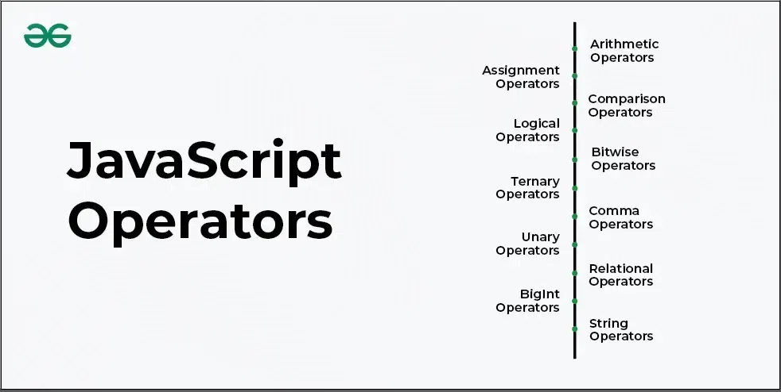

# JavaScript Operators
JavaScript operators are symbols or keywords used to perform operations on values and variables. They are the building blocks of JavaScript expressions and can manipulate data in various ways.



## There are various operators supported by JavaScript.
### **1. JavaScript Arithmetic Operators**
Arithmetic Operators perform mathematical calculations like addition, subtraction, multiplication, etc.
```bash
const sum = 5 + 3; // Addition
const diff = 10 - 2; // Subtraction
const p = 4 * 2; // Multiplication
const q = 8 / 2; // Division
console.log(sum, diff, p, q);

output:
8 8 8 4
```

* + adds two numbers.
* – subtracts the second number from the first.
* * multiplies two numbers.
* / divides the first number by the second.


### **2. JavaScript Assignment Operators**
Assignment operators are used to assign values to variables. They can also perform operations like addition or multiplication before assigning the value.
```bash
let n = 10;
n += 5;
n *= 2;
console.log(n);

output:
30
```

* = assigns a value to a variable.
* += adds and assigns the result to the variable.
* *= multiplies and assigns the result to the variable.


### **3. JavaScript Comparison Operators**
Comparison operators compare two values and return a boolean
```bash
console.log(10 > 5);
console.log(10 === "10");

output:
true
false
```

* > checks if the left value is greater than the right.
* === checks for strict equality (both type and value).
* Other operators include <, <=, >=, and !==.

### **4. JavaScript Logical Operators**
Comparison operators are mainly used to perform the logical operations that determine the equality or difference between the values.
```bash
const a = true, b = false;
console.log(a && b); // Logical AND
console.log(a || b); // Logical OR

output:
false
true
```

* && returns true if both operands are true.
* || returns true if at least one operand is true.
* ! negates the boolean value.


### **5. JavaScript Bitwise Operators**
Bitwise operators perform operations on binary representations of numbers.
```bash
const res = 5 & 1; // Bitwise AND
console.log(res);

output:
1
```

* & performs a bitwise AND.
* | performs a bitwise OR.
* ^ performs a bitwise XOR.
* ~ performs a bitwise NOT.

### **6. JavaScript Ternary Operator**
The ternary operator is a shorthand for conditional statements. It takes three operands.
```bash
const age = 18;
const status = age >= 18 ? "Adult" : "Minor";
console.log(status);

output:
Adult
```
condition ? expression1 : expression2 evaluates expression1 if the condition is true, otherwise evaluates expression2.

### **7. JavaScript Comma Operator**
Comma Operator (,) mainly evaluates its operands from left to right sequentially and returns the value of the rightmost operand.
```bash
let n1, n2
const res = (n1 = 1, n2 = 2, n1 + n2);
console.log(res);

output:
3
```
* Each expression is evaluated from left to right.
* The final result of the expression is the rightmost value.

### **8. JavaScript Unary Operators**
Unary operators operate on a single operand (e.g., increment, decrement).
```bash
let x = 5;
console.log(++x); // Pre-increment
console.log(x--); // Post-decrement (Output: 6, then x becomes 5)

output:
6
6
```
* ++ increments the value by 1.
* — decrements the value by 1.
* typeof returns the type of a variable.

### **9. JavaScript Relational Operators**
JavaScript Relational operators are used to compare its operands and determine the relationship between them. They return a Boolean value (true or false) based on the comparison result.
```bash
const obj = { length: 10 };
console.log("length" in obj);
console.log([] instanceof Array);

output:
true
true
```
* in checks if a property exists in an object.
* instanceof checks if an object is an instance of a constructor.

### **10. JavaScript BigInt Operators**
BigInt operators allow calculations with numbers beyond the safe integer range.
```bash
const big1 = 123456789012345678901234567890n;
const big2 = 987654321098765432109876543210n;
console.log(big1 + big2);

output:
1111111110111111111011111111100n
```
* Operations like addition, subtraction, and multiplication work with BigInt.
* Use n suffix to denote BigInt literals.

### **11. JavaScript String Operators**
JavaScript String Operators include concatenation (+) and concatenation assignment (+=), used to join strings or combine strings with other data types.
```bash
const s = "Hello" + " " + "World";
console.log(s);

output:
Hello World
```
* + concatenates strings.
* += appends to an existing string.


### **12. JavaScript Chaining Operator (?.)**
The optional chaining operator allows safe access to deeply nested properties without throwing errors if the property doesn’t exist.
```bash
const obj = { name: "Aman", address: { city: "Delhi" } };
console.log(obj.address?.city);
console.log(obj.contact?.phone);

output:
Delhi
undefined
```

* ?. safely accesses a property or method.
* Returns undefined if the property doesn’t exist.


