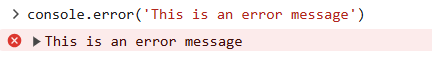
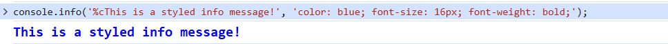

# **Console in JavaScript**
The console object provides access to the browser’s debugging console (or terminal in Node.js). It is used to log information, debug code, and interact with the runtime environment during development.

### **Commonly Used console Methods**
Here are the most frequently used methods of the console object:

### **1. console.log()**
The console.log() function logs general information to the console. This is one of the most commonly used methods for debugging in JavaScript.
```bash
console.log("Hello, World!");

output:
Hello, World!
```

### **2. console.error()**
The console .error() function in JavaScript Logs error messages to the console. Typically displayed in red. It is used to display an error message on the console.
```bash
console.error("This is an error message.");
output:
```



### **3. console .warn()**
The console. warn() function Logs warnings on to the console to warn the user about certain scenarios, typically displayed in yellow.
```bash
console.warn("This is a warning message.");
```


### **4. console.info()**
The console.info() logs informational messages, which usually appear as standard logs but can be styled differently in some environments. Using the %c flag and passing the style object as the second parameter to the function can be used to style the info message.
```bash
console.info('%cThis is a styled info message!', 'color: blue; font-size: 16px; font-weight: bold;');
```



### **5. console .table()**
console.table() is a method that displays data in a structured table format, making it easier to read and compare. It takes arrays or objects and organizes their properties or elements into rows and columns, helping with debugging or analyzing large or complex datasets.
```bash
console.table([{name: "Amit", age: 30}, {name: "Jatin", age: 25}]);
```

| Index |  Name | Age |
| :---: | :---: | :-: |
|   0   |  Amit |  30 |
|   1   | Jatin |  25 |


### **6. console .time() & console .timeEnd()**
The console.time() method starts a timer with a specified label, and console.timeEnd() stops the timer and logs the elapsed time in milliseconds. These methods are useful for measuring how long a block of code takes to execute.
```bash
console.time('timer1');
function loops() {
    for (let i = 0; i <= 10000; i++) {

    }
}
loops()
console.timeEnd('timer1');

output:
timer1: 0.278ms
```

### **7. console.assert()**
console.assert() logs an error message if the given condition is false, helping to catch issues during development. If the condition is true, it produces no output.
```bash
console.assert(5 > 10, "This assertion failed");
```


### **8. console .group() and console.groupEnd()**
The console.group() and console.groupEnd() methods let you group related logs together in the console. This makes it easier to organize and read logs, especially when debugging.
```bash
console.group('User Information');
console.log('Name: Ritik');
console.log('Age: 30');
console.groupEnd();

output:
User Information
Name: Ritik
Age: 30

```


### **9. console.count()**
console.count() logs the number of times it has been called with a specific label. It helps track how many times a particular code block or function is executed during runtime.
```bash
console.count("countLabel");  
console.count("countLabel"); 
console.count("countLabel");
console.count("countLabel");

output:
countLabel: 1
countLabel: 2
countLabel: 3
countLabel: 4
```

### **10. console.trace()**
The console.trace() method outputs a stack trace to the console, showing the path your code took to reach the point where it was called. This helps track the flow of execution and identify where a function was invoked.
```bash
function a() {
    b()
}
function b() {
    c()
}
function c() {
    console.trace()
}
a()
```


