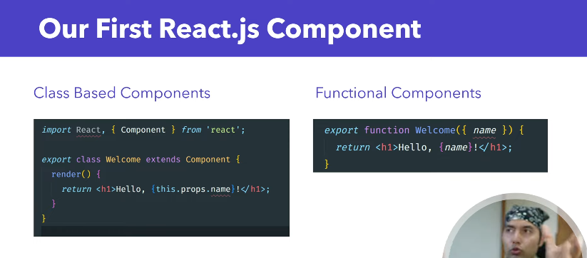

### What is a React Component?
A React Component is a reusable piece of UI (User Interface). It's like a JavaScript function or class that returns HTML using JSX.
* "React component ek block hai jo HTML, CSS, and JavaScript ko combine karke UI ka ek hissa banata hai."


<br>



### There are 2 Types of Components:
#### 1. Functional Component (Most Common)
#### 2. Class Component (Less Common Now)

## Functional Component
### Functional Component (Most Common) this is a Default export component
* Create / src/Profile.jsx
```bash
function Profile() {
    return (
        <div>
            <h1>Profile Page</h1>
            <p>This is the profile page of the user.</p>
        </div>
    )
}
export default Profile
```

* Use main.jsx
```bash
import { StrictMode } from 'react'
import { createRoot } from 'react-dom/client'
import App from './App.jsx'
import Profile from './Profile.jsx'

createRoot(document.getElementById('root')).render(
  <StrictMode>
    <App />
    <Profile />
  </StrictMode>,
)
```

## Class Component
```bash
import React from 'react';

class App extends React.Component {
  render() {
    return (
      <div>
        <h1>Helo World</h1>
      </div>
    );
  }
}
export default App;
```


---

#### Different Type of Export
* Default export
* Named Export


##### Named Export
* Create / src/Profile.jsx
```bash
export function Profile() {
    return (
        <div>
            <h1>Profile Page</h1>
            <p>This is the profile page of the user.</p>
        </div>
    )
}
```

* Use main.jsx
```bash
import { StrictMode } from 'react'
import { createRoot } from 'react-dom/client'
import App from './App.jsx'
import {Profile} from './Profile.jsx' // Named import with curly braces

createRoot(document.getElementById('root')).render(
  <StrictMode>
    <App />
    <Profile />
  </StrictMode>,
)
```

##### Default Export
```bash
function Profile() {
    return (
        <div>
            <h1>Profile Page</h1>
            <p>This is the profile page of the user.</p>
        </div>
    )
}
export default Profile
```

* Use main.jsx
```bash
import { StrictMode } from 'react'
import { createRoot } from 'react-dom/client'
import App from './App.jsx'
import Profile from './Profile.jsx'

createRoot(document.getElementById('root')).render(
  <StrictMode>
    <App />
    <Profile />
  </StrictMode>,
)
```
