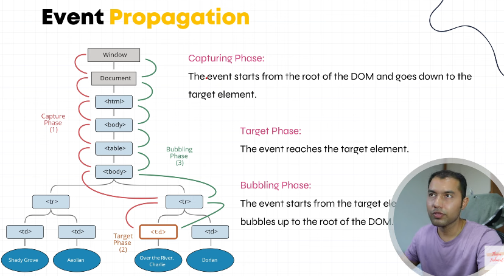

## OnClick
javscript me jis tarha funciton call krty ha us tarha react me nhi kr sakty.react me function call krty wqt camel case 
me call krna hota hain. function defination batani pharti hain. is tarha.


```javascript
function Profile() {

    // Normal JS function
    function data() {
        alert("Simple Function!");
    }

   // parameter Function
    function userinfo(name) {
        alert(name)
    }

    // Arrow function
    const data2 = () => {
        alert("Simple Arrow Function!");
    }

    // Arrow function with parameter
    const data3 = (name) => {
        alert("Arrow Function with parameter: " + name);
    }

    return (
        <div>
            <h2>Event And Function Call</h2>

            {/* Call normal function */}
            <button onClick={data}>Simple Function</button><br /><br />

            {/* Call peramter function */}
             // iska mtlb () => userinfo("Hussain") onclick arrow funciton call krega or arrow function userinfo ko call kr dega
             
             <button onClick={() => userinfo("Hussain")} className="btn btn-primary">Click Me</button> 

            {/* Call arrow function */}
            <button onClick={data2}>Simple Arrow Function</button><br /><br />

            {/* Call arrow function with parameter */}
            <button onClick={() => data3('hussain')}>
                Arrow Function with parameter
            </button><br />
        </div>
    )
}

export default Profile;
```

---
## Common React Events List
#### 1. Mouse Events
| Event                       | Description                         |
| --------------------------- | ----------------------------------- |
| `onClick`                   | Jab user click kare                 |
| `onDoubleClick`             | Double click par trigger            |
| `onMouseEnter`              | Jab mouse kisi element ke upar aaye |
| `onMouseLeave`              | Jab mouse element se bahar jaye     |
| `onMouseDown` / `onMouseUp` | Mouse press / release hone par      |
| `onContextMenu`             | Right-click par trigger hota hai    |


#### 2. Keyboard Events
| Event        | Description                                                |
| ------------ | ---------------------------------------------------------- |
| `onKeyDown`  | Jab key press hoti hai                                     |
| `onKeyUp`    | Jab key release hoti hai                                   |
| `onKeyPress` | Jab key press hoti hai (deprecated — `onKeyDown` use karo) |
 
```bash
<input type='text' onKeyUp={(e) => userinfo(e.target.value)}></input>
```

#### 3. Form Events
| Event      | Description                 |
| ---------- | --------------------------- |
| `onChange` | Input value change hone par |
| `onInput`  | Jab user likhta hai         |
| `onSubmit` | Form submit hone par        |
| `onFocus`  | Input focus me aane par     |
| `onBlur`   | Focus chodne par            |

```javascript
<form onSubmit={(e) => { e.preventDefault(); userinfo(e.target[0].value) }}>
        <input onChange={(e) => console.log(e.target.value)} />
        <button type="submit">Submit</button>
</form>
```      

#### 4. Clipboard Events
| Event     | Description         |
| --------- | ------------------- |
| `onCopy`  | Jab user copy kare  |
| `onCut`   | Jab user cut kare   |
| `onPaste` | Jab user paste kare |


#### 5. Drag Events
| Event         | Description                   |
| ------------- | ----------------------------- |
| `onDrag`      | Jab element drag ho raha ho   |
| `onDragStart` | Drag start hone par           |
| `onDragEnd`   | Drag khatam hone par          |
| `onDrop`      | Jab drop ho                   |
| `onDragOver`  | Drop area par hover karne par |


#### 6. Image / Media Events
| Event     | Description               |
| --------- | ------------------------- |
| `onLoad`  | Jab image ya file load ho |
| `onError` | Jab load me error aaye    |


#### 7. Misc Events
| Event      | Description                 |
| ---------- | --------------------------- |
| `onScroll` | Scroll hone par             |
| `onResize` | Window resize hone par      |
| `onWheel`  | Mouse wheel scroll hone par |


---
## JavaScript function call
Ye normal JavaScript function hota hai jo kuch kaam karta hai aur phir result return karta hai.
* Jab function call hota hai, sirf ek value return hoti hai (number, string, object, etc).
* Iska React ya UI se koi lena dena nahi, ye sirf logic run karta hai.
```javascript
function add(a, b) {
  return a + b;
}

console.log(add(2, 3)); // 5
```

## React function call (Function Component)
* React me function ka kaam UI (HTML JSX) return karna hota hai.
* Ye normal JS function jaisa hi lagta hai, lekin difference ye hai ke ye JSX (UI structure) return karta hai.
```javascript
function Button() {
  return <button>Click Me</button>;
}
```
* Jab React isko "call" karta hai, ye actual me <Button /> ke form me likha jata hai, aur React us return JSX ko DOM me render karta hai.
* Iska result screen pe visible hota hai, na ke sirf console ya variable me.


---

## Passing Events as Props 


#### Parent Component (Parent.js)
```javascript
import React from "react";
import Child from "./Child";

export default function Parent() {
  const handleClick = () => {
    alert("Button clicked in child component!");
  };

  return (
    <div>
      <h2>Parent Component</h2>
      {/* Passing function as a prop */}
      <Child onButtonClick={handleClick} />
    </div>
  );
}
```

#### Child Component (Child.js)
```javascript
import React from "react";

export default function Child({ onButtonClick }) {
  return (
    <div>
      <h3>Child Component</h3>
      {/* Using the function passed as prop */}
      <button onClick={onButtonClick}>Click Me</button>
    </div>
  );
}

```

---

## What is Event Propagation?
Event Propagation refers to how an event (like a click) travels through the DOM hierarchy when triggered.

#### There are two main phases:
* Capturing phase → event moves from the top (root) down to the target element.
* Bubbling phase → event moves from the target back up to the root.




??


---


