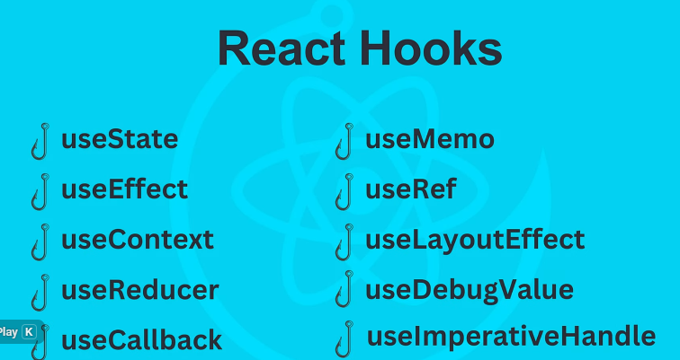
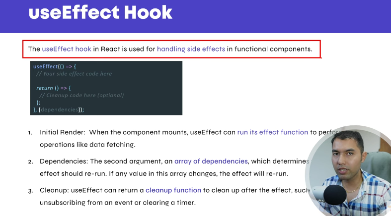
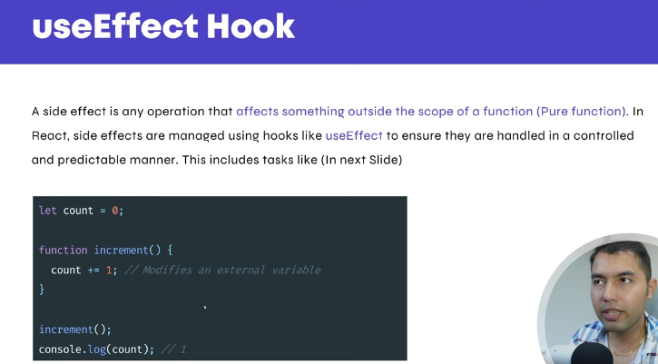
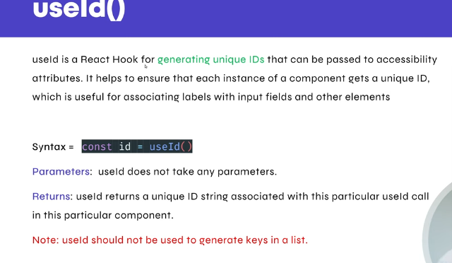

## What is State Management?
* State management means how you store, update, and share data (state) in your application so your UI stays in sync with that data.
* "State management" is all about keeping track of what’s happening inside your app — and making sure your UI updates automatically when that data changes.
* agr ap button click pr ya kisi or event tigger pr data change krty ha or ussy component me(fronend pr) dekhana chahty hato state Management ka use krty ha.

---

* State eik inmutable process ha jisy State ko change nhi kr sakty. 
* State ko Change krny ka kam State ka function kryga --> jasy setCount
* State is a hooks ho component ko re render krke dynamically data component me dekhata ha
```bash
const [count, setCount] = useState(0);
```


#### Reactivity:
When you update state using setState or setX from useState, React re-renders the component, keeping the UI in sync with the current data.

#### Local Component Data:
State is used for data that only a specific component needs, like whether a dropdown is open or which tab is selected.

#### Avoid Direct DOM Manipulation:
React prefers declarative UI logic. Rather than using DOM methods to manually update elements, you update the state, and React handles rendering.


### 1. What is State in React
State in React is a built-in object that stores dynamic data in a component. It determines how that component behaves and how it renders. When the state changes, React automatically re-renders the component to reflect the new data.

* State is a Container to store data like variable. 
* this is mutable and dynamic.
* when have to import it when we want to use it.
* it re,render component automatically so that data can visible on ui

State ko hum hooks ki help se use kr sakty hain. hooks wo hoty hain jo use sy start hoty hain jasy.
```bash
import { useState, useEffect,useContext } from "react";
```

### Simple State Concept
```bash
import { useState } from "react"

function Profile() {
    const [fruit,setfruit] = useState('mango')

    const handler=()=>{
        setfruit('banana')
    }
    return (
        <div>
            <p>{fruit}</p>
            <button onClick={handler}>set data</button>
        </div>
    )
}

export default Profile
```

### Second Example
```bash
import { useState } from "react";

function Profile() {

    const [count, setcount] = useState(0)
    const handdler = () => {
        setcount(count + 1)
    }

    const decrement = () => {
        setcount(count - 1)
    }
    return (

        <div>
            <p>{count}</p>
            <button onClick={handdler}>increment</button>
            <button onClick={decrement}>Drecement</button>
        </div>
    )
}

export default Profile
```

---

## How React State Works
State is an object that stores data that changes over time in a component.
When the state changes, React re-renders that component (and its children, if needed).
*The memory of a component that can change and trigger UI updates.*


---

## What is Derived State in React?
Derived State means state that is computed from other existing state or props, instead of being stored separately.

If you can calculate a value from existing state or props, you don’t need to store it as new state — you just derive it when rendering.

### ❌ Bad: Redundant state
```bash
import { useState } from "react";

function Example() {
  const [items] = useState([1, 2, 3, 4]);
  const [total, setTotal] = useState(0);

  // ❌ Derived data stored separately
  useEffect(() => {
    setTotal(items.length);
  }, [items]);

  return <p>Total items: {total}</p>;
}
```

### Good: Derive instead of storing
```bash
import { useState } from "react";

function Example() {
  const [items] = useState([1, 2, 3, 4]);
  const total = items.length; // derived directly

  return <p>Total items: {total}</p>;
}
```
### Using derived state:
```bash
import { useState } from "react";

function ProductList() {
  const [products] = useState([
    { name: "Laptop", price: 1200 },
    { name: "Phone", price: 800 },
    { name: "Tablet", price: 600 },
  ]);
  const [query, setQuery] = useState("");

  // Derived state: depends on products + query
  const filteredProducts = products.filter(p =>
    p.name.toLowerCase().includes(query.toLowerCase())
  );

  return (
    <div>
      <input
        placeholder="Search..."
        value={query}
        onChange={e => setQuery(e.target.value)}
      />
      <ul>
        {filteredProducts.map(p => (
          <li key={p.name}>{p.name}</li>
        ))}
      </ul>
    </div>
  );
}

```

---

##  Lifting State Up in React:
Lifting State Up in React is a fundamental concept that helps in sharing data between multiple components by moving the state to their closest common ancestor.

When two or more components need to share or synchronize data, instead of keeping separate states in each component, we lift the state up to a parent component.


#### ❌ Wrong Approach: Separate State in Each Component
```bash
function CelsiusInput() {
  const [celsius, setCelsius] = useState('');
  return <input value={celsius} onChange={(e) => setCelsius(e.target.value)} />;
}

function FahrenheitInput() {
  const [fahrenheit, setFahrenheit] = useState('');
  return <input value={fahrenheit} onChange={(e) => setFahrenheit(e.target.value)} />;
}
```

#### ✅ Correct Approach: Lifting State Up
```bash
import { useState } from "react";

function TemperatureConverter() {
  const [temperature, setTemperature] = useState('');

  function handleCelsiusChange(e) {
    setTemperature(e.target.value);
  }

  function handleFahrenheitChange(e) {
    const fahrenheit = e.target.value;
    const celsius = ((fahrenheit - 32) * 5) / 9;
    setTemperature(celsius);
  }

  const fahrenheit = (temperature * 9) / 5 + 32;

  return (
    <div>
      <CelsiusInput value={temperature} onChange={handleCelsiusChange} />
      <FahrenheitInput value={fahrenheit} onChange={handleFahrenheitChange} />
    </div>
  );
}

function CelsiusInput({ value, onChange }) {
  return (
    <div>
      <label>Celsius:</label>
      <input value={value} onChange={onChange} />
    </div>
  );
}

function FahrenheitInput({ value, onChange }) {
  return (
    <div>
      <label>Fahrenheit:</label>
      <input value={value} onChange={onChange} />
    </div>
  );
}
```


 

<br>



```bash
// App.jsx
import './App.css';
import { useState } from 'react';

function App() {

  const [count, setCount] = useState(0);
  const [step, setStep] = useState(1);

  const handleIncrement = () => {
    setCount(count + step);
  }

  const handlederement = () => {
    if (count > 0) {
      setCount(count - step);

    }
  }

  const restCount = () => {
    setCount(0);
  }

  const handdleStep = (value) => {
    setStep(value)
  }


  return (
    <>
      <div style={{ textAlign: "center", marginTop: "50px" }}>
        <h2>Count: {count}</h2>

        <input type="number" value={step} onChange={(event) => handdleStep(Number(event.target.value))} />

        <button onClick={handleIncrement}>Increment</button>
        <button onClick={handlederement}>Decrement</button>
        <button onClick={restCount}>Rest Count</button>
      </div>
    </>
  );
}

export default App;
```

## useEffect Hook (React)
useEffect React ka ek powerful Hook hai jo side effects handle karne ke liye use hota hai

* API calls
* DOM manipulation
* Event listeners add/remove
* Local Storage operations
* Timers (setTimeout, setInterval)

<br>




### Basic Syntax
```bash
useEffect(() => {
  // Side effect code
});
```



###  useEffect Hook with Dependency Array
```bash
import { useState, useEffect } from "react";

function Counter() {
  const [count, setCount] = useState(0);

  // Jab count change ho to ye chalega
  useEffect(() => {
    console.log("Count updated:", count);
  }, [count]);

  return (
    <div style={{ textAlign: "center", marginTop: "50px" }}>
      <h1>Count: {count}</h1>

      <button onClick={() => setCount(count + 1)}>
        +
      </button>

      <button onClick={() => setCount(count - 1)}>
        -
      </button>

      <button onClick={() => setCount(0)}>
        Reset
      </button>
    </div>
  );
}

export default Counter;
```

## useEffect Cleanup Function
useEffect ka Cleanup Function React me tab use hota hai jab aapko koi side-effect remove, unsubscribe, ya stop karna ho.
React cleanup function ko component unmount hone par aur dependency change hone par call karta hai.

```bash
useEffect(() => {
  // side effect

  return () => {
    // cleanup code
  };
}, []);
```

### 1️⃣ setInterval / setTimeout ko clear karna
```bash
useEffect(() => {
  const interval = setInterval(() => {
    console.log("Running...");
  }, 1000);

  // Cleanup
  return () => {
    clearInterval(interval);
    console.log("Interval cleared!");
  };
}, []);

```

### 2️⃣ Event Listener remove karna
```bash
useEffect(() => {
  const handleResize = () => {
    console.log("Window resized");
  };

  window.addEventListener("resize", handleResize);

  return () => {
    window.removeEventListener("resize", handleResize);
  };
}, []);

```

### 3️⃣ API abort controller (fetch cancel)
```bash
useEffect(() => {
  const controller = new AbortController();

  fetch("https://jsonplaceholder.typicode.com/posts", {
    signal: controller.signal
  });

  return () => controller.abort();  // cancel request
}, []);

```

## Dependency Change Par Cleanup
Jab dependency change hoti hai, pehle cleanup run hota hai, phir effect phir se run hotta hai.

```bash
useEffect(() => {
  console.log("Effect:", count);

  return () => {
    console.log("Cleanup before next effect");
  };
}, [count]);
```

---

## useRef Hook
useRef React ka ek hook hai jo mutable value ko store karta hai without causing re-renders.


<br>

#### When to Use useRef?
* Kisi DOM element ko directly access karna ho
* Re-render bina value store karna ho
* Previous value track karni ho
* Timer/interval store karna ho

### 1. DOM Elements ko Access Karna
Agar aap kisi HTML element ko directly access karna chahtay hain (like input focus, scroll, video play), toh useRef best hai.
```bash
import { useRef } from "react";

function MyComponent() {
  const inputRef = useRef(null);

  const focusInput = () => {
    inputRef.current.focus();
  };

  return (
    <>
      <input ref={inputRef} type="text" />
      <button onClick={focusInput}>Focus</button>
    </>
  );
}
```

### 2. Re-render Bina Value Store Karna
useRef me value change karne se component re-render nahi hota.
Agar aap koi value track karna chahte hain, jo UI me reflect nahi karwani, useRef use hota hai.

```bash
const countRef = useRef(0);
countRef.current = countRef.current + 1;
```

### 3. Previous Value Ko Track Karna
useRef se aap previous props/state ko bhi store kar sakte hain.

```bash
const prevCount = useRef();

useEffect(() => {
  prevCount.current = count;
}, [count]);

```

| Hook        | Purpose                          |
| ----------- | -------------------------------- |
| `useState`  | Value change → re-render         |
| `useRef`    | Value change → **no re-render**  |
| `useEffect` | Side effects (API calls, timers) |


---

## useId Hook
useId React ka built-in hook hai jo unique, stable IDs generate karta hai — especially accessibility (A11y) ke liye useful.




### useId kya karta hai?
* Har component render per unique ID banata hai
* Server Side Rendering (SSR) aur hydration me consistent ID generate karta hai
* Form controls / labels ko correctly pair karne me help karta hai
* Client aur server IDs mismatch nahi hote


```bash
import { useId } from "react";

function Form() {
  const id = useId();

  return (
    <div>
      <label htmlFor={id}>Username</label>
      <input id={id} type="text" />
    </div>
  );
}
```

