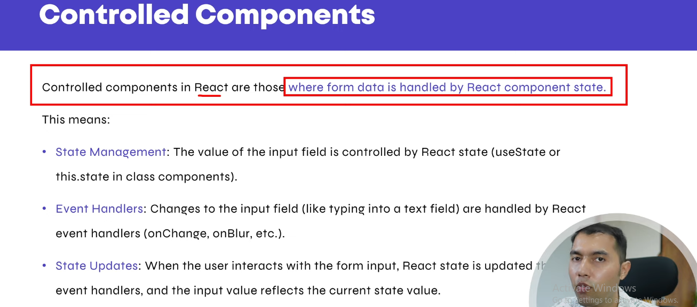
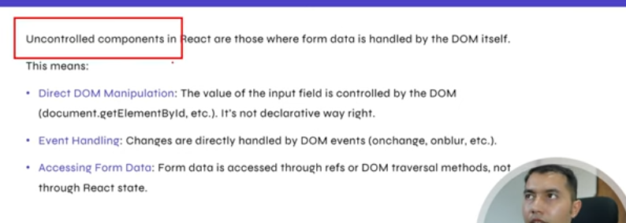

## Controlled vs Uncontrolled Components



<br>




### Controlled Components
A controlled component is a form element (like <input>, <textarea>, <select>) whose value is controlled by React state.
* React is the single source of truth for the input’s value.
* You update the state using onChange events.

```javascript
import { useState } from "react";

function ControlledInput() {
  const [name, setName] = useState("");

  const handleChange = (e) => {
    setName(e.target.value);
  };

  return (
    <div>
      <input type="text" value={name} onChange={handleChange} />
      <p>Your name: {name}</p>
    </div>
  );
}

export default ControlledInput;
```
#### ✅ Pros:
* Easy to validate input.
* React always knows the current value.
* Can reset or manipulate value programmatically.

#### ✅ Cons:
* Requires more boilerplate.
* Can be slower with very large forms (rarely an issue).


## Uncontrolled Components
An uncontrolled component is a form element where React does not control its value.
* The DOM itself handles the input value.
* To get the value, you use a ref (useRef).

```javascript
import { useRef } from "react";

function UncontrolledInput() {
  const inputRef = useRef(null);

  const handleClick = () => {
    alert("Input value: " + inputRef.current.value);
  };

  return (
    <div>
      <input type="text" ref={inputRef} />
      <button onClick={handleClick}>Show Value</button>
    </div>
  );
}

export default UncontrolledInput;
```
#### ✅ Pros:
* Less code for simple forms.
* Works well with libraries that rely on the DOM.

#### ✅ Cons:
* Harder to validate or manipulate input in real time.
* React doesn’t “know” the input value until you query the DOM.

### Quick Comparison Table
| Feature                        | Controlled Component | Uncontrolled Component |
| ------------------------------ | -------------------- | ---------------------- |
| **Value stored in**            | React state          | DOM                    |
| **Updates via**                | `onChange`           | `ref`                  |
| **Validation**                 | Easy                 | Harder                 |
| **Resetting programmatically** | Easy                 | Harder                 |
| **Boilerplate**                | More                 | Less                   |

