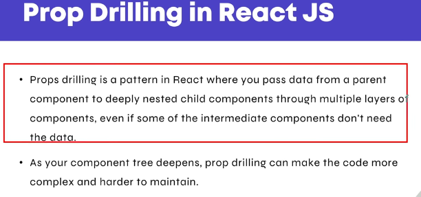
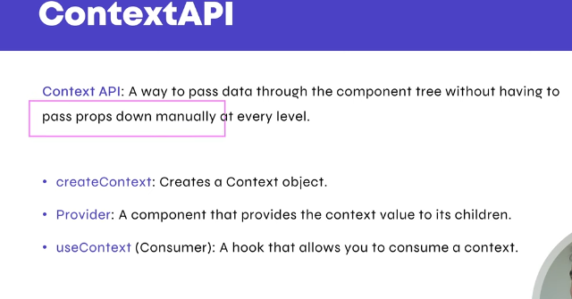
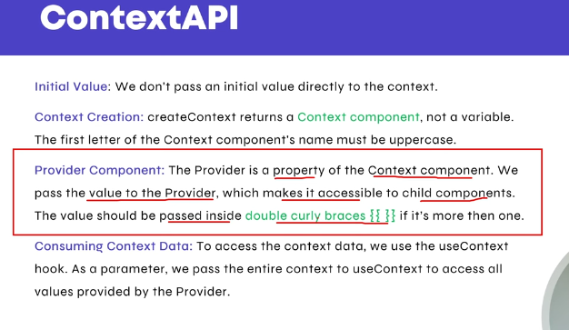

## Prop Drilling
Prop Drilling React ka wo concept hai jisme data ko parent component se bohot neeche tak bhejna padta hai, even un components ko bhi jinko us data ki zaroorat nahi hoti, sirf isliye kyunki neeche wale component ko data chahiye hota hai.

* A → B → C → D → E
A component me data hai, lekin E ko use karna hai.
Isliye aapko props ko B → C → D ke through pass karna padta hai — even though unko us data ki zaroorat nahi.

### Why Prop Drilling is a Problem?
* Code messy ho jata
* Maintain karna mushkil
* Har intermediate component ko unwanted props milte
* Re-renders ziyada hotay
* Large apps me manage karna difficult

### Example of Prop Drilling Problem



```javascript
function App() {
  const user = "Muhammad Hussain";

  return <Parent user={user} />;
}

function Parent({ user }) {
  return <Child user={user} />;
}

function Child({ user }) {
  return <GrandChild user={user} />;
}

function GrandChild({ user }) {
  return <p>Hello, {user}</p>;
}

```

---
## How to Avoid Prop Drilling (React Context API)
React ne is problem ko solve karne ke liye kuch tools diye hai

### 1. React Context API
React Context API ek aisa feature hai jo props drilling ko avoid karne ke liye use hota hai. Jab aapko data ko parent → child → grandchild → deeper components tak bhejna ho aur har step pe props pass na karna chahe, to Context API use hota hai.

<br>



<br>




#### src/contexts/UserContext.js
```javascript
import { createContext } from "react";
export const UserContext = createContext(null); // default value optional
```

#### src/providers/UserProvider.jsx
```javascript
import React, { useState } from "react";
import { UserContext } from "../contexts/UserContext";

export default function UserProvider({ children }) {
  const [user, setUser] = useState("Muhammad Hussain");

  return (
    <UserContext.Provider value={{ user, setUser }}>
      {children}
    </UserContext.Provider>
  );
}
```

#### src/components/Profile.jsx
```javascript
import React, { useContext } from "react";
import { UserContext } from "../contexts/UserContext";

function Profile() {
  const { user } = useContext(UserContext);

  return <h1>Hello, {user}</h1>;
}

export default Profile;
```

#### src/App.jsx
```javascript
import React, { useContext } from "react";
import UserProvider from "./providers/UserProvider";
import Profile from "./components/Profile";
import { UserContext } from "./contexts/UserContext";

function InnerApp() {
  // example showing setUser usage
  const { setUser } = useContext(UserContext);

  return (
    <div>
      <Profile />
      <button onClick={() => setUser("Ali Khan")}>Change User</button>
    </div>
  );
}

export default function App() {
  return (
    <UserProvider>
      <InnerApp />
    </UserProvider>
  );
}
```
