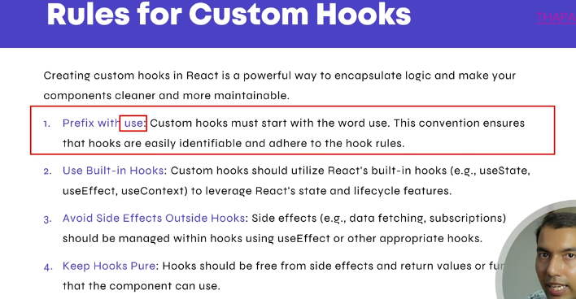

## Custom Hooks





#### App.jsx
```bash
import useToggle from "./useToggle";

function Counter() {

  const [value, togglevalue] = useToggle(true)
  const [value2, togglevalue2] = useToggle(true)

  console.log(value)
  return (
    <>

      <br />
      <button onClick={togglevalue}>Toggle button</button>
      <button onClick={() => togglevalue(false)}>Hide</button>
      <button onClick={() => togglevalue(true)}>Show</button>
      {value ? <h1>Custom Hook in React Js section 1</h1> : null}

      <br />

      <button onClick={togglevalue2}>Toggle button</button>
      <button onClick={() => togglevalue2(false)}>Hide</button>
      <button onClick={() => togglevalue2(true)}>Show</button>
      {value2 ? <h1>Custom Hook in React Js section 2</h1> : null}

    </>


  );
}

export default Counter;
```


#### useToggle.jsx (custom hook)
```bash
import { useState } from "react";

const useToggle = (defaultVal) => {
    const [value, SetValue] = useState(defaultVal);

    function togglevalue(val) {

        if (typeof val != "boolean") {
            SetValue(!value)
        }
        else {
            SetValue(val)
        }
    }

    return [value, togglevalue]


    return (
        <>
        </>
    )
}

export default useToggle;
```