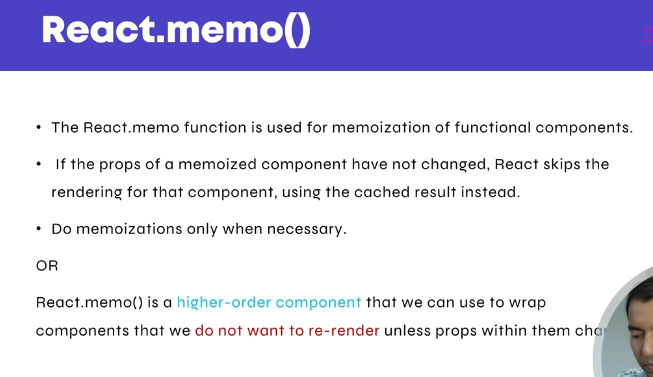

## React.memo():
React.memo is a higher-order component in React that helps optimize performance by preventing unnecessary re-renders of a functional component. It’s like PureComponent for functional components.

### Here’s the key idea:
* React components re-render when their props or state change.
* Sometimes, a component doesn’t need to re-render if its props haven’t changed.
* React.memo wraps a functional component and tells React: “Only re-render me if my props actually change.”




### Agr React Memo use nahi kry to ye issue ayega.

#### App.jsx
```bash
import { MemoCount } from "./Memo/MemoCount";
import { ReactMemo } from "./Memo/ReactMemo";

function App() {
  return (
    <>
      <ReactMemo />
    </>


  );
}

export default App;
```

#### ReactMemo
```bash
import { useState } from "react";
import { MemoCount } from "./MemoCount";

export function ReactMemo() {
    const [value, setCount] = useState(0);

    return (
        <>
            <p>Count: {value}</p>
            <button onClick={() => setCount(prev => prev + 1)}>
                Increment
            </button>

            <MemoCount />
        </>
    );
}
```

### MemoCount.jsx
```bash
import { useRef } from "react";

export function MemoCount() {
  const renderCount = useRef(0);

  renderCount.current++; // Increment on every render
  console.log("MemoCount Render:", renderCount.current);

  return (
    <>
      <p>MemoCount Rendered: {renderCount.current} times</p>
    </>
  );
}
```

#### issue
issue ye ha jab me increment button pr click kroga to MemoCount Component me iski value chnage hony lagy ge

```bash
<p>MemoCount Rendered: {renderCount.current} times</p>
```