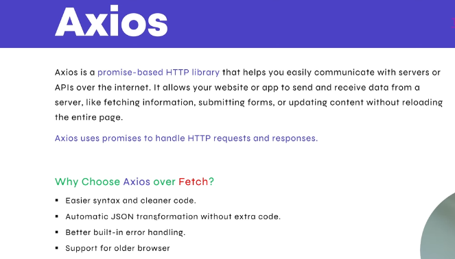

##  Axios in React 
Axios React me server se data get/post karne ke liye use hota hai. Ye ek HTTP client library hai jo fetch se zyada simple aur readable code deti hai.



```bash
npm install axios
```

#### wrap the root with BrowserRouter:
```bash
// index.js
import React from "react";
import { createRoot } from "react-dom/client";
import { BrowserRouter } from "react-router-dom";
import App from "./App";

createRoot(document.getElementById("root")).render(
  <React.StrictMode>
    <BrowserRouter>
      <App />
    </BrowserRouter>
  </React.StrictMode>
);
```

#### App.jsx
```bash
import Moviedata from "./pages/Moviedata"

const App = () => {
  return <Moviedata />
}
export default App
```

#### Moviedata.jsx
```bash
import axios from "axios"
import { useEffect, useState } from "react"
import Card from "../pages/Card"

const Moviedata = () => {

    const [Moviedata, setData] = useState([])

    const api = "https://www.omdbapi.com/?i="

    const getMoviewData = async () => {
        try {
            const res = await axios.get(api)
            setData([res.data]);

        } catch (error) {
            console.log(error)
        }
    }

    useEffect(() => {
        getMoviewData()
    }, [])

    return (
        <ul>
            {Moviedata.map((curMovie) => (
                <Card key={curMovie.imdbID} curMovie={curMovie} />
            ))}
        </ul>
    )
}

export default Moviedata;
```

#### Card.jsx
```bash
import { NavLink } from "react-router-dom";
import "./Card.css";

const Card = ({ curMovie }) => {
    const { Poster, imdbID, Title, Country } = curMovie;
    console.log(curMovie);

    return (
        <>
            <li className="hero-container">
                <div className="main-container">
                    <div className="poster-container">
                        
                        <h2>{Title}</h2>
                    </div>
                    <div className="ticket-container">
                        <div className="ticket__content">
                            <NavLink to={`/movie/${imdbID}`}>
                                <button className="ticket__buy-btn">Watch now</button>
                            </NavLink>
                        </div>
                    </div>
                </div>
            </li>
        </>
    )
}
export default Card
```