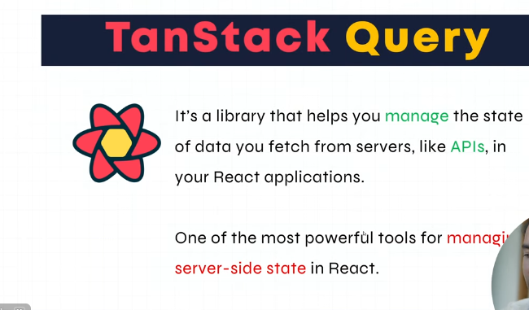

## What is TanStack Query
TanStack Query (pehle React Query ke naam se mashhoor) React apps ke andar server state management ko asaan banane ke liye use hota hai. Ye API se data fetch, cache, update, refetch, background syncing, loading/error states—all automatically handle karta hai.

---

### Simple Words Me TanStack Query Kya Hai?
#### Aap API ka data manually fetch karte ho:
* loading state banana
* error state handle karna
* refetching karna
* caching karna
* stale data ko manage karna

---

#### TanStack Query yeh sab automatic kar deta hai.
* Aap sirf ek hook lagate ho, aur sab handle ho jata hai.

---

### Main Features
#### Automatic Caching
* Data memory me save ho jata hai, bar-bar fetch nahi hota.

#### Refetch on Window Focus
* Tab change karke wapas aao → data fresh ho jata hai.

#### Background Updates
* Purana data dikhta rehega jab tak naya data aa nahi jata.

#### Retry on Failure
* API fail ho jaye to automatically retry karta hai.

#### Easy Mutations
* POST/PUT/DELETE requests ko easy bana deta hai.
