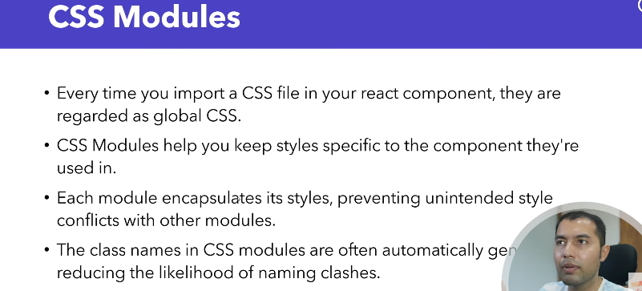
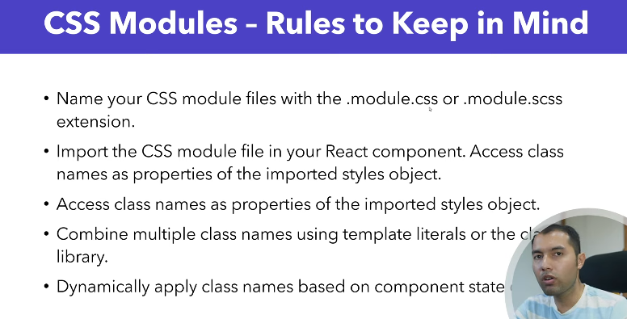

## Css Module



<br>




## Module Style For a Component
#### src/Button.module.css
```bash
import React from 'react'
import BtnNodule from "./Button.module.css"

function App() {
  return (
    <>
      <p>Hello <span className={BtnNodule.success}>World</span></p>
    </>
  )
}
export default App
```

#### App.jsx
```bash
import React from 'react'
import BtnNodule from "./Button.module.css"

function App() {
  return (
    <>
      <p>Hello <span className={BtnNodule.success}>World</span></p>
    </>
  )
}

export default App
```