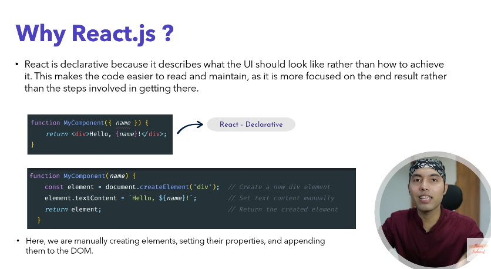
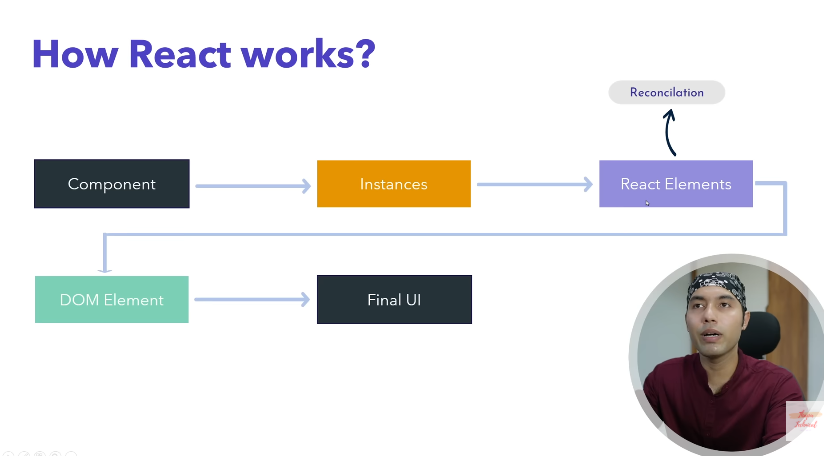

##### Course Make For this 
https://www.youtube.com/watch?v=4z9bvgTlxKw&list=PLwGdqUZWnOp1Rab71vx2zMF6qpwGDB2Z1

## What is React.js?
React.js (commonly called React) is a JavaScript library for building user interfaces, mainly for web applications. It was developed by Facebook and is now maintained as an open-source project. React focuses on creating fast, interactive, and reusable UI components.

### Why Use React.js?
* Reusable Components: Save time by reusing code across the app.
* Fast & Efficient: Virtual DOM reduces unnecessary updates.
* Strong Community & Ecosystem: Many libraries, tools, and resources available.
* SEO-Friendly: With tools like Next.js, React can be used for server-side rendering, improving SEO.

 

 

#### Component-Based Architecture
* Applications are built using components, which are reusable and modular pieces of code.
* Example: A Button component can be reused throughout the app.

#### Virtual DOM
* React uses a Virtual DOM to improve performance.
* When a component’s state changes, React updates only the changed parts in the actual DOM instead of reloading the entire page.

#### JSX (JavaScript XML)
* React uses JSX, which allows you to write HTML-like syntax inside JavaScript.

#### One-way Data Binding
* Data flows from parent to child components (unidirectional).
* This makes apps more predictable and easier to debug.

#### State & Props
* State: Represents dynamic data within a component.
* Props: Short for properties, used to pass data from parent to child components.
