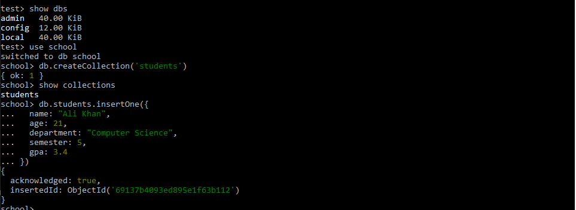
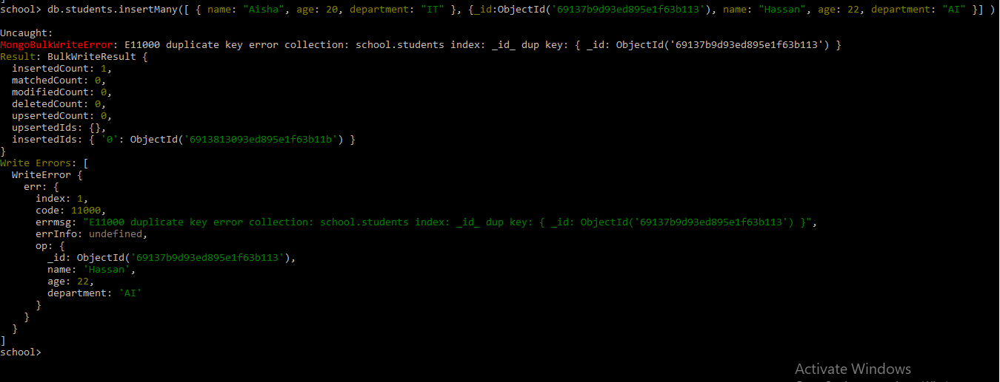
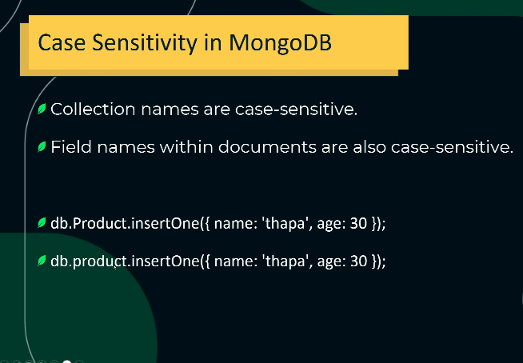
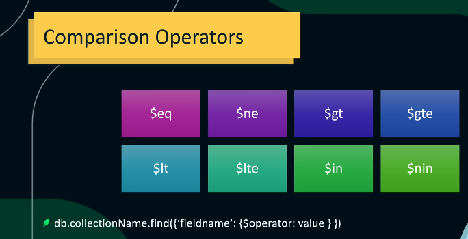

# Advance Insert Operation 
### 1. insertOne
```bash
db.students.insertOne({
  name: "Ali Khan",
  age: 21,
  department: "Computer Science",
  semester: 5,
  gpa: 3.4
})
```
<br>



<br>

### 2. insertMany

```bash
db.students.insertMany([
  { name: "Aisha", age: 20, department: "IT" },
  { name: "Hassan", age: 22, department: "AI" }
])
```


<br>


<br>


<br>

**Agr ap insertMany me multiple recorde inert kr rahy ho or bech ke kisi operation me error a jaye to ussy pehly wala data insert hoga sirf. bad wala nhi insert hoga.**

<br>


<br>


#### Example (jab bulk data insert me already exits Student id wala data insert kiya gaya ho)
<br>




#### Example 2 (jab bulk data insert me already exits Student id wala data insert kro. to baki all data insert ho jayega.error wali emtry ko chor kr)

```bash
db.students.insertMany([
  { name: "Aisha", age: 20, department: "IT" },
  { _id: ObjectId('69137b9d93ed895e1f63b113'), name: "Hassan", age: 22, department: "AI" }
], 
{ ordered: false })
```



<br>

---

# Read Operation in MongoDB
* Read document
* comparison operator'
* logical operators
* Cursors Mongodb
* Elements Operators


## Find Document

#### find
```bash
db.students.find()
```

#### findOne
```bash
db.students.findOne({ name: "Aisha" })
```
<br>


<br>

```bash
mongoimport "C:\Users\user\Downloads\mongo_json_data\products.json" -d shop -c products --jsonArray
```

#### Example
```bash
"C:\Program Files\MongoDB\Tools\100\bin\mongoimport.exe" --file "C:\Users\user\Downloads\mongo_json_data\products.json" -d shop -c products
```
<br>


## Comparison Operators


<br>

| Operator | Meaning               | Example                         | Description                       |
| -------- | --------------------- | ------------------------------- | --------------------------------- |
| `$eq`    | Equal to              | `{ age: { $eq: 20 } }`          | age **exactly 20** wale documents |
| `$ne`    | Not equal to          | `{ department: { $ne: "AI" } }` | department **AI nahi** wale       |
| `$gt`    | Greater than          | `{ age: { $gt: 20 } }`          | age **20 se zyada**               |
| `$gte`   | Greater than or equal | `{ age: { $gte: 20 } }`         | age **20 ya usse zyada**          |
| `$lt`    | Less than             | `{ age: { $lt: 25 } }`          | age **25 se kam**                 |
| `$lte`   | Less than or equal    | `{ age: { $lte: 25 } }`         | age **25 ya usse kam**            |


#### 1. Students older than 20
```bash
db.students.find({ age: { $gt: 20 } })
```

#### 2. Students age 20 or older
```bash
db.students.find({ age: { $gte: 20 } })
```

#### 3. Students age not equal to 22
```bash
db.students.find({ age: { $ne: 22 } })
```

#### 4. Students age between 20 and 24
```bash
db.students.find({ age: { $gte: 20, $lte: 24 } })
```

#### 5. Combine with other fields
```bash
db.students.find({
  department: "AI",
  age: { $gt: 20 }
})
```

#### 6. Get Count
```bash
db.students.find().count()
```

#### 7. in or nin
| Operator | Meaning                               | Example                                  |
| -------- | ------------------------------------- | ---------------------------------------- |
| `$in`    | matches any value in array            | `{ department: { $in: ["IT", "CS"] } }`  |
| `$nin`   | does **not** match any value in array | `{ department: { $nin: ["AI", "CS"] } }` |


## what is cursor in mongodb
In MongoDB, a cursor is an object that allows you to iterate over the results of a query. It acts as a pointer to the documents in a collection that match your query. Instead of returning all results at once, MongoDB returns a cursor, and you can then fetch documents one by one or in batches.

* When you run a query like db.collection.find(), MongoDB does not return all documents immediately.
* It returns a cursor pointing to the matching documents.
* You can then use methods like .next(), .forEach(), or .toArray() to access the data.

* Lazy evaluation: The query is executed on-demand as you iterate.
* Memory-efficient: Useful for large datasets because it doesn't load all documents at once.
* Methods: .next(), .hasNext(), .forEach(), .toArray(), .limit(), .sort().

### cursor mehtods

#### 1. Get Count
```bash
db.students.find().count()
```

#### 2. Set Limit
```bash
db.students.find().limit(1)
```
#### 3. Skip
```bash
db.students.find().limit(2).skip(1)
```
* Skips the first document in the result set.
* So, MongoDB ignores the first document and then returns the next 2.

#### 4. // Sort ascending
```bash
db.students.find().sort({ age: 1 });
```

#### 5. descending
```bash
db.collection.find(query).sort({ field1: 1, field2: -1 })
```
* 1 → ascending order (smallest to largest, A→Z).
* -1 → descending order (largest to smallest, Z→A).


---

## logical operators


### 1. $and
Matches documents that satisfy all conditions.

```bash
db.students.find({
  $and: [
    { age: { $gt: 18 } },
    { grade: "A" }
  ]
});
```

### 2. $or
Matches documents that satisfy at least one condition.
```bash
db.students.find({
  $or: [
    { grade: "A" },
    { age: { $lt: 18 } }
  ]
});
```

### 3. $not
Negates a condition.

```bash
db.students.find({
  age: { $not: { $gt: 18 } }
});
```

### 4. $nor
Matches documents that do not satisfy any of the conditions.
```bash
db.students.find({
  $nor: [
    { grade: "A" },
    { age: { $lt: 18 } }
  ]
});
```