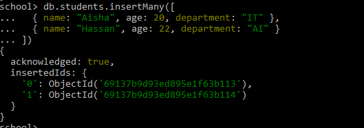

# Advance Insert Operation 

### 1. insertOne
```bash
db.students.insertOne({
  name: "Ali Khan",
  age: 21,
  department: "Computer Science",
  semester: 5,
  gpa: 3.4
})
```
<br>


<br>

### 2. insertMany

```bash
db.students.insertMany([
  { name: "Aisha", age: 20, department: "IT" },
  { name: "Hassan", age: 22, department: "AI" }
])
```



<br>

