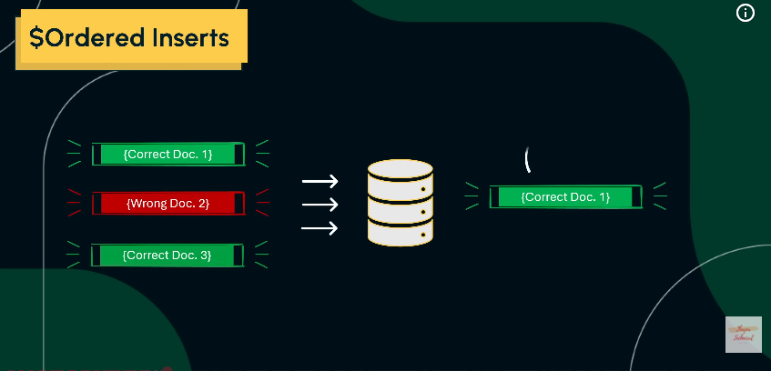
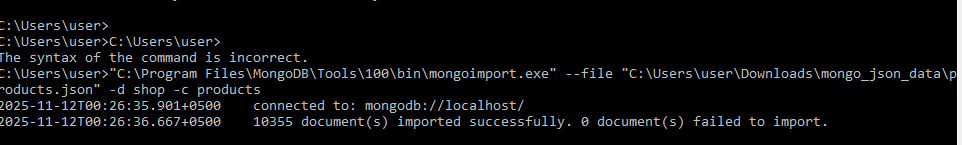

# Advance Insert Operation 
### 1. insertOne
```bash
db.students.insertOne({
  name: "Ali Khan",
  age: 21,
  department: "Computer Science",
  semester: 5,
  gpa: 3.4
})
```
<br>


<br>

### 2. insertMany

```bash
db.students.insertMany([
  { name: "Aisha", age: 20, department: "IT" },
  { name: "Hassan", age: 22, department: "AI" }
])
```


<br>


<br>


<br>

**Agr ap insertMany me multiple recorde inert kr rahy ho or bech ke kisi operation me error a jaye to ussy pehly wala data insert hoga sirf. bad wala nhi insert hoga.**

<br>


<br>



#### Example (jab bulk data insert me already exits Student id wala data insert kiya gaya ho)
<br>


#### Example 2 (jab bulk data insert me already exits Student id wala data insert kro. to baki all data insert ho jayega.error wali emtry ko chor kr)

```bash
db.students.insertMany([
  { name: "Aisha", age: 20, department: "IT" },
  { _id: ObjectId('69137b9d93ed895e1f63b113'), name: "Hassan", age: 22, department: "AI" }
], 
{ ordered: false })
```


<br>

---

# Read Operation in MongoDB
* Read document
* comparison operator'
* logical operators
* Cursors Mongodb
* Elements Operators


### Find Document

#### find
```bash
db.students.find()
```

#### findOne
```bash
db.students.findOne({ name: "Aisha" })
```
<br>


<br>

```bash
mongoimport "C:\Users\user\Downloads\mongo_json_data\products.json" -d shop -c products --jsonArray
```

#### Example
```bash
"C:\Program Files\MongoDB\Tools\100\bin\mongoimport.exe" --file "C:\Users\user\Downloads\mongo_json_data\products.json" -d shop -c products
```
<br>



<br>


