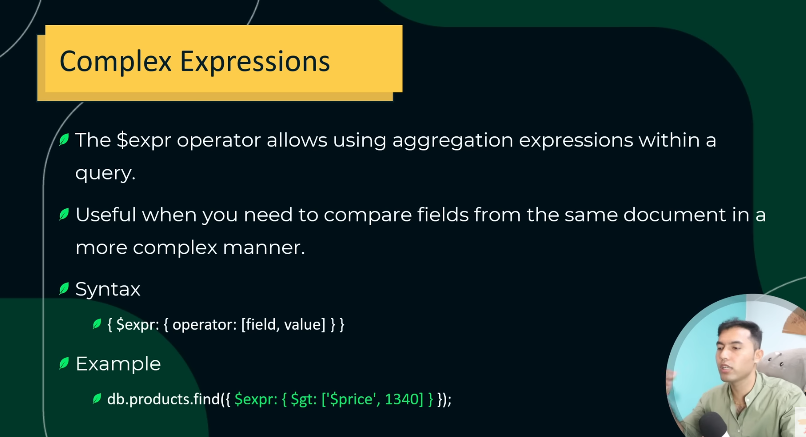
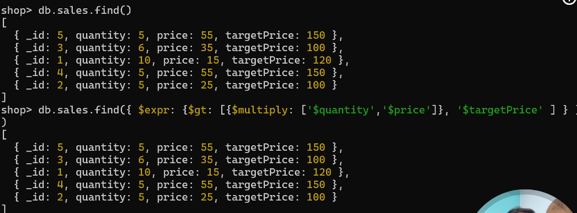

## Mongodb Expression
In MongoDB, an expression is a statement used to compute values during queries, updates, aggregations, or projections.
Expressions are used inside operators (like $expr, $project, $match, $addFields, etc.) to perform calculations, comparisons, or transformations on documents.




```bash
db.students.find({
  $expr: { $gt: ["$marks", 80] }
})
```
* $expr allows you to use aggregation expressions in a query.
* $gt means “greater than”.
* "$marks" refers to the field marks in each document.
* This finds all students where marks > 80.

* age quantity or price multiply krke wo value agr totalprice sy zada aye to wo get kro recorde collection sy.


| Type            | Operator    | Example                                                                    | Description                      |
| --------------- | ----------- | -------------------------------------------------------------------------- | -------------------------------- |
| **Arithmetic**  | `$add`      | `{ $add: ["$price", 10] }`                                                 | Adds numbers                     |
|                 | `$subtract` | `{ $subtract: ["$max", "$min"] }`                                          | Subtracts one value from another |
|                 | `$multiply` | `{ $multiply: ["$price", 2] }`                                             | Multiplies values                |
|                 | `$divide`   | `{ $divide: ["$total", "$count"] }`                                        | Divides values                   |
| **Comparison**  | `$eq`       | `{ $eq: ["$status", "active"] }`                                           | Equal to                         |
|                 | `$ne`       | `{ $ne: ["$role", "admin"] }`                                              | Not equal                        |
|                 | `$gt`       | `{ $gt: ["$age", 18] }`                                                    | Greater than                     |
|                 | `$lt`       | `{ $lt: ["$age", 50] }`                                                    | Less than                        |
| **Logical**     | `$and`      | `{ $and: [ { $gt: ["$age", 18] }, { $lt: ["$age", 30] } ] }`               | Logical AND                      |
|                 | `$or`       | `{ $or: [ { $eq: ["$city", "Lahore"] }, { $eq: ["$city", "Karachi"] } ] }` | Logical OR                       |
|                 | `$not`      | `{ $not: [{ $eq: ["$status", "inactive"] }] }`                             | Logical NOT                      |
| **String**      | `$concat`   | `{ $concat: ["$firstName", " ", "$lastName"] }`                            | Joins strings                    |
|                 | `$toUpper`  | `{ $toUpper: "$name" }`                                                    | Converts to uppercase            |
| **Array**       | `$size`     | `{ $size: "$tags" }`                                                       | Returns array length             |
|                 | `$in`       | `{ $in: ["$city", ["Lahore", "Karachi"]] }`                                | Checks membership                |
| **Conditional** | `$cond`     | `{ $cond: { if: { $gt: ["$marks", 50] }, then: "Pass", else: "Fail" } }`   | If-else logic                    |


