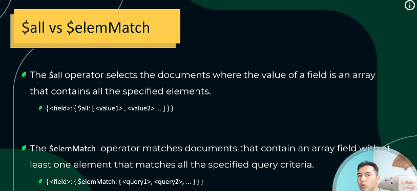

## Projections
In MongoDB, a projection is used to control which fields are returned in query results.
It helps you fetch only the data you need, reducing bandwidth and improving performance.


<br>

* 👉 1 = include field
* 👉 0 = exclude field

### Basic Syntax
```bash
db.collection.find(<filter>, <projection>)
```
* <filter> → defines which documents to match
* <projection> → defines which fields to include or exclude


### Include Specific Fields (1)
```bash
db.students.find({}, { name: 1, age: 1 })
```

### Exclude Specific Fields (0)
```bash
db.students.find({}, { address: 0, phone: 0 })
```
* All fields except address and phone will appear.
* You cannot mix inclusion and exclusion in one projection (except _id).

### Exclude _id Field
```bash
db.students.find({}, { _id: 0, name: 1, age: 1 })
```
* Returns only name and age, without _id.

### Projection with Dot Notation (Nested Fields)
```bash
db.students.find({}, { "contact.email": 1, "contact.phone": 1 })
```
* Includes only specific fields from a nested document (like contact).

### Array Projection (Using $elemMatch)
```bash
db.students.find(
  { name: "Ali" },
  { scores: { $elemMatch: { type: "exam" } } }
)
```
* Returns only the first element in scores array that matches { type: "exam" }.

---

## Embedded Document
An embedded document (ya nested document) woh hota hai jisme ek field ke andar aur ek document (object) store hota hai.
Matlab — ek document ke andar dusra document.


```bash
{
  _id: 1,
  name: "Ali",
  age: 22,
  address: {
    city: "Lahore",
    street: "Main Blvd",
    zip: "54000"
  }
}
```

### Accessing Embedded Fields
```bash
db.students.find({ "address.city": "Lahore" })
```
### Update Embedded Document
```bash
db.students.updateOne(
  { name: "Ali" },
  { $set: { "address.city": "Karachi" } }
)
```

### Why Use Embedded Documents?
| Reason                                       | Explanation                                        |
| -------------------------------------------- | -------------------------------------------------- |
| **1. Related data ek hi document me rakhna** | Taki joins ki zarurat na pade (MongoDB NoSQL hai). |
| **2. Faster reads**                          | Ek hi document fetch karna padta hai.              |
| **3. Data structure maintain hota hai**      | Hierarchical / JSON-like format me data rakhte ho. |

### Example Summary
| Concept        | Example                                   | Description                |
| -------------- | ----------------------------------------- | -------------------------- |
| Embedded field | `"address": { "city": "Lahore" }`         | Document inside a document |
| Query          | `{ "address.city": "Lahore" }`            | Access nested value        |
| Projection     | `{ "address.city": 1 }`                   | Show only city             |
| Update         | `{ $set: { "address.city": "Karachi" } }` | Modify embedded field      |

---

## $all VS &elemMatch
ye MongoDB array query operators me se do important aur similar lagne wale operators hain,



| Feature           | `$all`                                             | `$elemMatch`                                                       |
| ----------------- | -------------------------------------------------- | ------------------------------------------------------------------ |
| **Use case**      | Jab array me **multiple values** hone chahiye      | Jab array ke **ek hi element** par multiple conditions lagani ho   |
| **Checks**        | Array me **sab given values** maujood hain ya nahi | Array me **koi ek element** sab conditions match karta hai ya nahi |
| **Works on**      | Simple arrays (values)                             | Arrays of documents (objects)                                      |
| **Operator type** | Matching multiple values                           | Matching multiple conditions on one element                        |
| **Example type**  | `[ "red", "blue", "green" ]`                       | `[ {type: "exam", score: 80}, {type: "quiz", score: 50} ]`         |

### 1. $all — Check Multiple Values in Array

#### Example Collection
```bash
{
  _id: 1,
  colors: ["red", "blue", "green"]
}
```


```bash
db.items.find({ colors: { $all: ["red", "green"] } })
```
* Find those documents jinke colors array me red aur green dono maujood hain (order matter nahi karta).


### 2. $elemMatch — Match One Element That Meets Multiple Conditions

#### Example Collection
```bash
{
  _id: 1,
  scores: [
    { type: "exam", score: 90 },
    { type: "quiz", score: 50 }
  ]
}
```

```bash
db.students.find({
  scores: { $elemMatch: { type: "exam", score: { $gt: 80 } } }
})
```
* Find documents jinke scores array me ek hi element ho jisme type "exam" aur score 80 se zyada ho.

---

## Advanced Update Operations in MongoDB


### 1. Basic Update Recap
```bash
db.collection.updateOne(
  { _id: 1 },
  { $set: { name: "Ali" } }
)
```
* This replaces/sets the name field. But advanced operations let you manipulate arrays, multiple fields, or use aggregation logic.

### 2. Field Update Operators
#### a) $inc – Increment numeric fields

```bash
db.products.updateOne(
  { name: "Laptop" },
  { $inc: { stock: 5, price: -100 } }
)
```
* Adds 5 to stock and decreases price by 100.

#### b) $mul – Multiply numeric fields
```bash
db.products.updateOne(
  { name: "Laptop" },
  { $mul: { price: 1.1 } } // Increase price by 10%
)
```

#### c) $rename – Rename a field
```bash
db.products.updateOne(
  { name: "Laptop" },
  { $rename: { "stock": "inventory" } }
)
```

#### d) $min / $max – Update only if lower/higher
```bash
db.products.updateOne(
  { name: "Laptop" },
  { $min: { price: 900 } } // Sets price to 900 only if current price > 900
)
```

### 3. Array Update Operators
#### a) $push – Add elements to array
```bash
db.students.updateOne(
  { name: "Ali" },
  { $push: { scores: 95 } }
)
```

#### b) $each – Push multiple elements
```bash
db.students.updateOne(
  { name: "Ali" },
  { $push: { scores: { $each: [85, 90] } } }
)
```

#### c) $position – Insert at specific index
```bash
db.students.updateOne(
  { name: "Ali" },
  { $push: { scores: { $each: [100], $position: 0 } } }
)

```

#### d) $addToSet – Add only if not exists (unique)
```bash
db.students.updateOne(
  { name: "Ali" },
  { $addToSet: { subjects: "Math" } }
)

```

#### e) $pop – Remove first (-1) or last (1)
```bash
db.students.updateOne(
  { name: "Ali" },
  { $pop: { scores: -1 } } // removes first element
)

```

#### f) $pull – Remove elements by condition
```bash
db.students.updateOne(
  { name: "Ali" },
  { $pull: { scores: { $lt: 50 } } } // remove all scores < 50
)

```

#### g) $pullAll – Remove multiple values
```bash
db.students.updateOne(
  { name: "Ali" },
  { $pullAll: { scores: [60, 70] } }
)

```

### 4. Using $ (Positional Operator)
Update a specific array element matching a condition:

```bash
db.students.updateOne(
  { "scores": 90 },
  { $set: { "scores.$": 95 } } // replace first 90 with 95
)
```

### 5. Array Filters (Advanced Positional Updates)
For multiple array elements:
```bash
db.students.updateOne(
  { name: "Ali" },
  { $set: { "scores.$[elem]": 100 } },
  { arrayFilters: [ { "elem": { $lt: 50 } } ] }
)
```
* Sets all scores < 50 to 100.

### 6. Upsert
Creates document if it doesn’t exist:

```bash
db.products.updateOne(
  { name: "Tablet" },
  { $set: { price: 300, stock: 20 } },
  { upsert: true }
)
```

### 7. Update with Aggregation Pipeline (MongoDB 4.2+)
You can use aggregation expressions inside updates:
```bash
db.products.updateOne(
  { name: "Laptop" },
  [
    { $set: { price: { $multiply: ["$price", 1.1] } } }
  ]
)
```
* Here $price is multiplied by 1.1 using aggregation pipeline.

### 8. Bulk Updates
updateMany() – Update multiple documents:

```bash
db.students.updateMany(
  { grade: "A" },
  { $inc: { bonusPoints: 5 } }
)
```
* bulkWrite() – Multiple operations in one call:

```bash
db.students.bulkWrite([
  { updateOne: { filter: { name: "Ali" }, update: { $set: { grade: "B" } } } },
  { updateOne: { filter: { name: "Sara" }, update: { $inc: { score: 10 } } } }
])
```


### Summary

| Operation                    | Purpose                            |
| ---------------------------- | ---------------------------------- |
| `$set`                       | Set/update field                   |
| `$inc`                       | Increment numeric value            |
| `$mul`                       | Multiply numeric value             |
| `$rename`                    | Rename field                       |
| `$min`/`$max`                | Conditional update based on value  |
| `$push`                      | Add array element                  |
| `$addToSet`                  | Add unique array element           |
| `$pop`                       | Remove first/last array element    |
| `$pull`                      | Remove array elements by condition |
| `$pullAll`                   | Remove multiple array values       |
| `$[]` / `$[<identifier>]`    | Update specific array elements     |
| `upsert`                     | Insert if not exists               |
| Aggregation Pipeline Updates | Complex field computation          |


