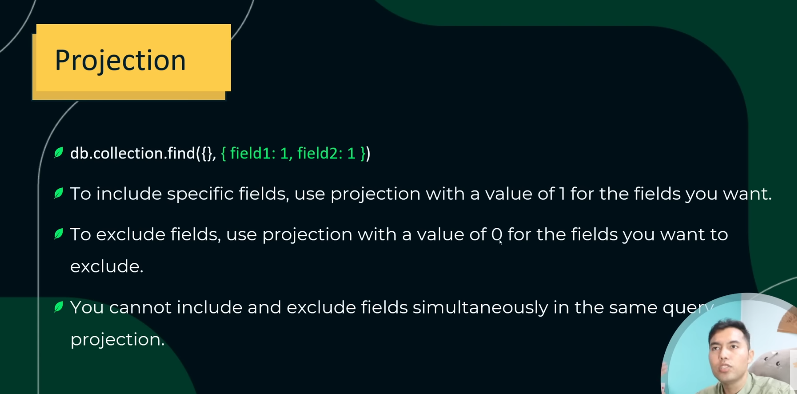
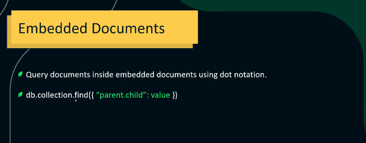

## Projections
In MongoDB, a projection is used to control which fields are returned in query results.
It helps you fetch only the data you need, reducing bandwidth and improving performance.



<br>

* 👉 1 = include field
* 👉 0 = exclude field

### Basic Syntax
```bash
db.collection.find(<filter>, <projection>)
```
* <filter> → defines which documents to match
* <projection> → defines which fields to include or exclude


### Include Specific Fields (1)
```bash
db.students.find({}, { name: 1, age: 1 })
```

### Exclude Specific Fields (0)
```bash
db.students.find({}, { address: 0, phone: 0 })
```
* All fields except address and phone will appear.
* You cannot mix inclusion and exclusion in one projection (except _id).

### Exclude _id Field
```bash
db.students.find({}, { _id: 0, name: 1, age: 1 })
```
* Returns only name and age, without _id.

### Projection with Dot Notation (Nested Fields)
```bash
db.students.find({}, { "contact.email": 1, "contact.phone": 1 })
```
* Includes only specific fields from a nested document (like contact).

### Array Projection (Using $elemMatch)
```bash
db.students.find(
  { name: "Ali" },
  { scores: { $elemMatch: { type: "exam" } } }
)
```
* Returns only the first element in scores array that matches { type: "exam" }.

---

## Embedded Document
An embedded document (ya nested document) woh hota hai jisme ek field ke andar aur ek document (object) store hota hai.
Matlab — ek document ke andar dusra document.



```bash
{
  _id: 1,
  name: "Ali",
  age: 22,
  address: {
    city: "Lahore",
    street: "Main Blvd",
    zip: "54000"
  }
}
```

### Accessing Embedded Fields
```bash
db.students.find({ "address.city": "Lahore" })
```
### Update Embedded Document
```bash
db.students.updateOne(
  { name: "Ali" },
  { $set: { "address.city": "Karachi" } }
)
```

| Reason                                       | Explanation                                        |
| -------------------------------------------- | -------------------------------------------------- |
| **1. Related data ek hi document me rakhna** | Taki joins ki zarurat na pade (MongoDB NoSQL hai). |
| **2. Faster reads**                          | Ek hi document fetch karna padta hai.              |
| **3. Data structure maintain hota hai**      | Hierarchical / JSON-like format me data rakhte ho. |

