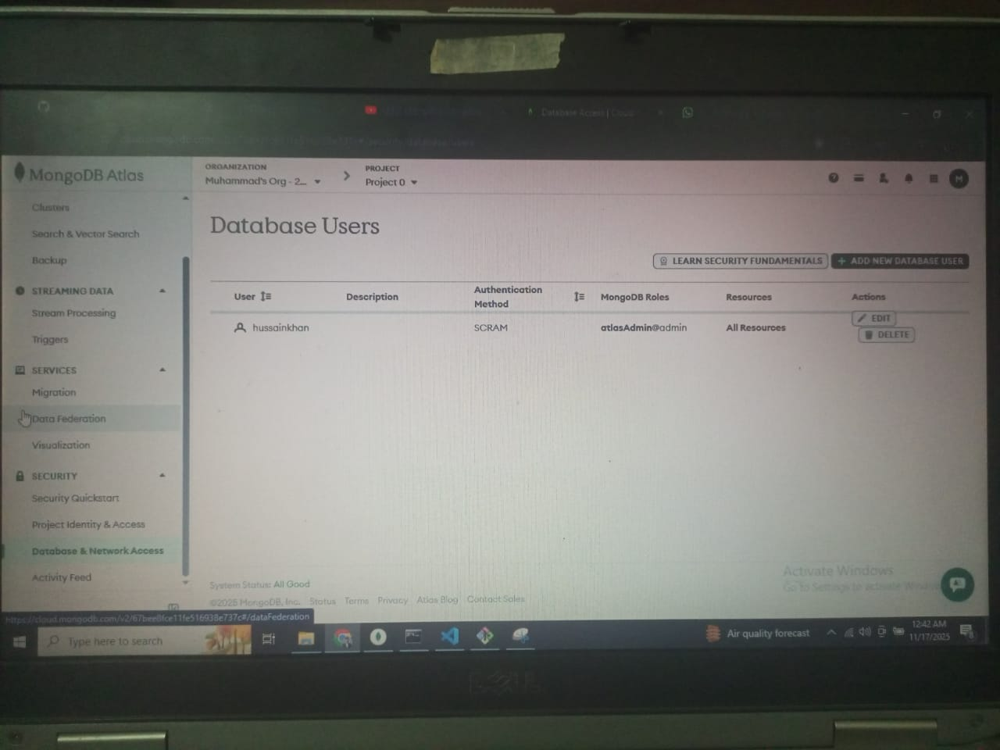
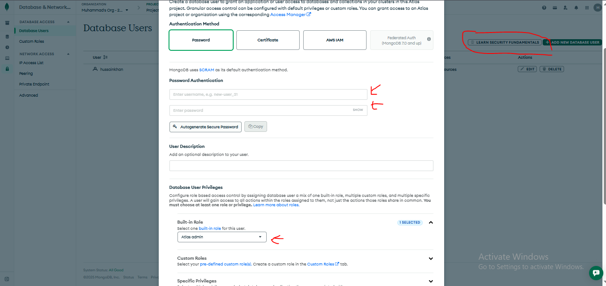
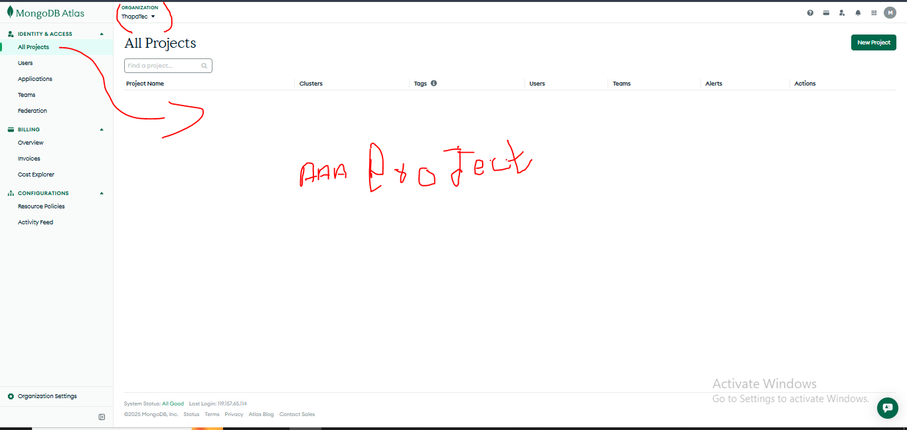
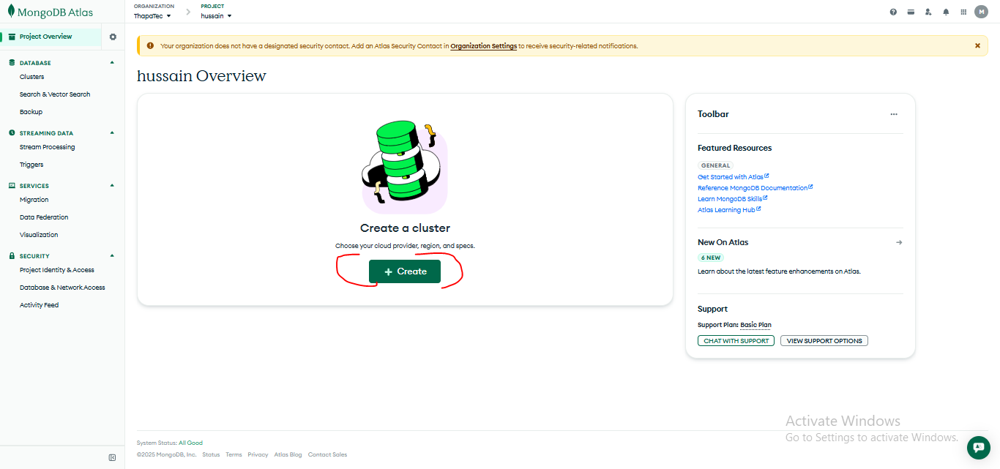
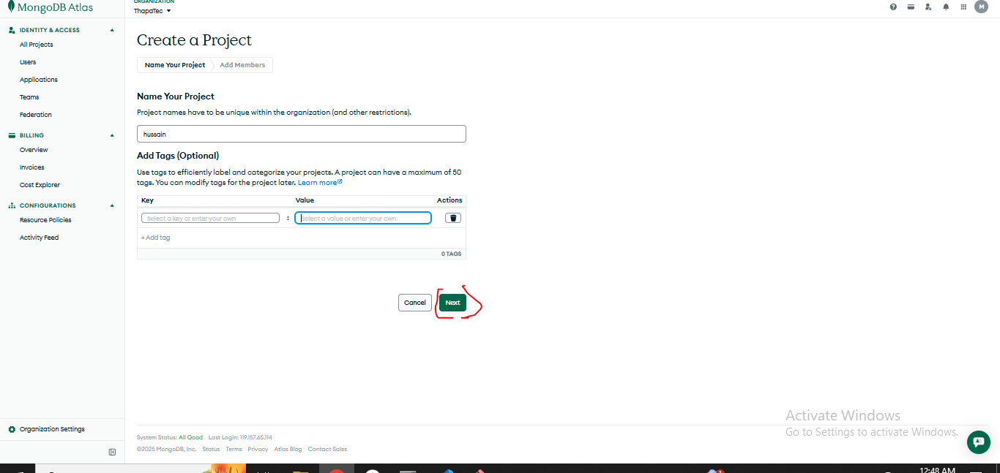
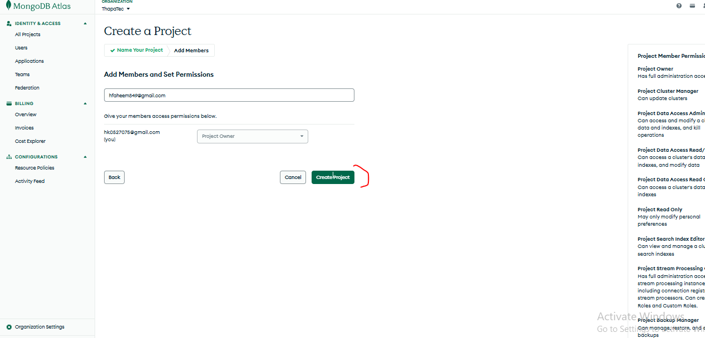
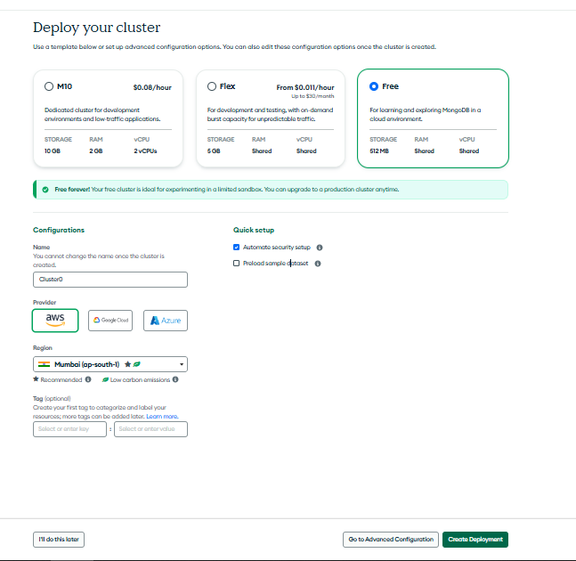
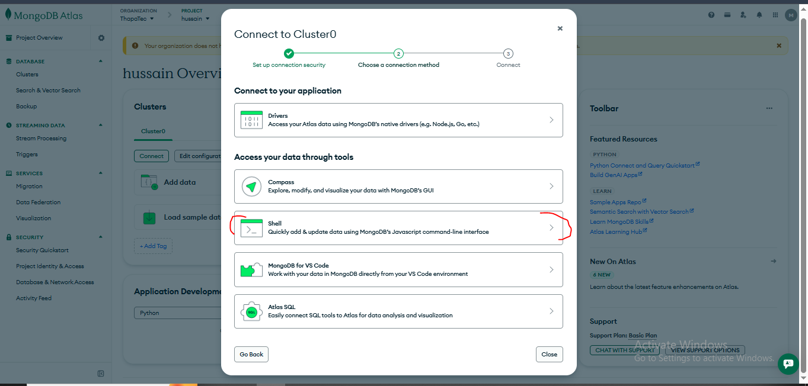
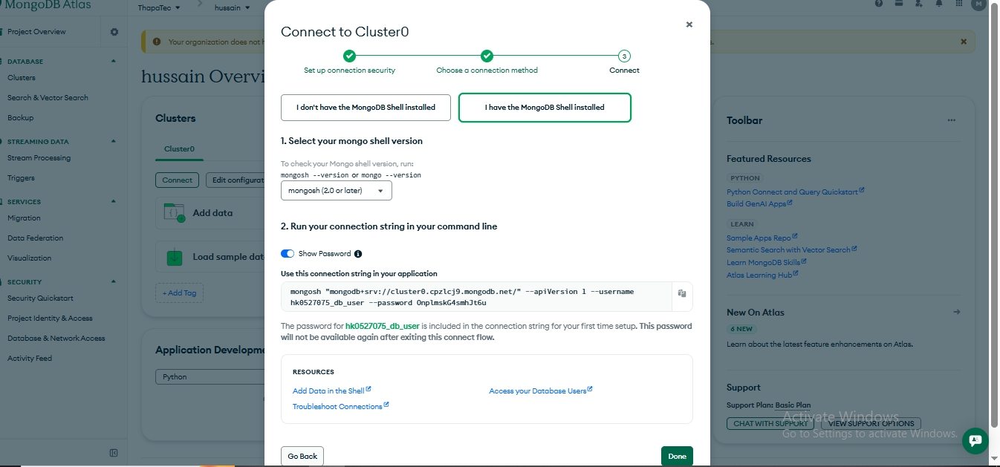
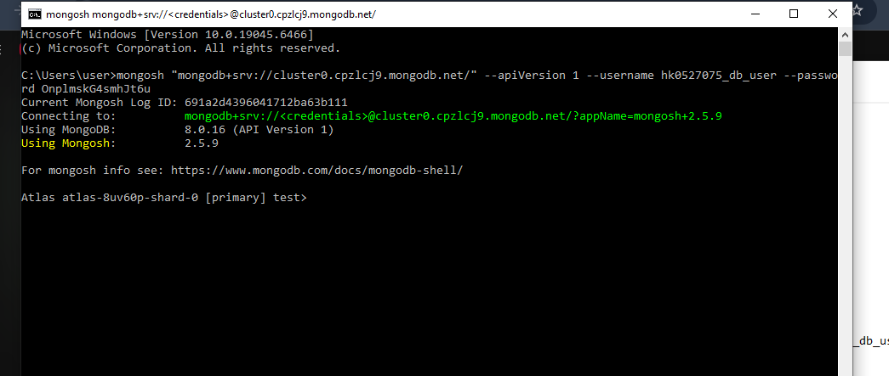

## Mongodb Atlas

 

#### Database User Creation
* Go to Security--> Database And network Access
* Add New Database User
* Set Username and password
* Built-in-Role -->Built-in Role
* Click Add User Button

---

#### Project Creation
* Goto organizations (Basically Create new project)
* Select MongoDB Atlas (Colud services)
* click the Create button

---
#### Project Create krny ke bad

 

#### Add Project Process
 

 

 

 

 

---

#### Create Clustor

* Select Free 
* Set Cluster name --> Cluster0

 

 

 

* Copy Connection String

 

* Goto System Cmd and run Connection string on cmd. you will see. we have connect the atlas

 

