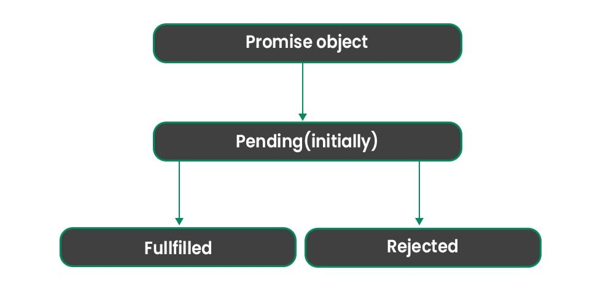

### 1. Synchronous 
Jab JavaScript ka code line by line chalti hai, pehle wali line complete hoti hai, phir agli chalti hai, usko kehte hain synchronous code.
```bash
console.log("1");
console.log("2");
console.log("3");

```
* Agar koi function zyada waqt le raha ho (jaise file read karna ya server se data lana), to poora program ruk jata hai jab tak wo kaam complete na ho

### 2. Asynchronous Code – (Wait mat karo, agla kaam shuru karo)
Jab koi kaam waqt leta ho, to JavaScript usko chhor kar agla kaam shuru kar leti hai. Jab pehle kaam complete hota hai, to baad me uska result milta hai. Isko kehte hain asynchronous code.

```bash
console.log("1");

setTimeout(function() {
  console.log("2");
}, 2000);

console.log("3");
```
* Pehle 1 aur 3 print hua. setTimeout wala kaam delay ho gaya, to 2 baad me aaya.

### Callback 
Callback ek aisi function hoti hai jo doosre function ko argument me di jaati hai, aur jab wo doosra function apna kaam complete karta hai, tab callback ko call karta hai.

```bash
function greetUser(name, callback) {
  console.log("Hello, " + name);
  callback();
}

function sayBye() {
  console.log("Allah Hafiz!");
}

greetUser("Ahmed", sayBye);
```

### Callback Hell Example
Jab aap ek function ke andar doosra function call karte ho, phir uske andar teesra, phir uske andar chautha...
is tarah ka code bahut complex aur ganda ho jata hai — usi ko kehte hain Callback Hell.

```bash
function getData(dataid, getNextData) {
  setTimeout(() => {
    console.log("data", dataid);
    if (getNextData) {
      getNextData();
    }
  }, 2000);
}

getData(1, () => {
  getData(2, () => {
    getData(3, () => {
      getData(4);
    });
  });
});

```
* Har function ke andar ek aur callback. Yeh structure "pyramid of doom" banata hai — samajhna aur maintain karna mushkil.

### Callback Hell Problems ka Solution: Promises
Promise JavaScript ka ek object hota hai jo future me koi kaam hone ka wada karta hai.
* Ye ya to kaam successfully complete karta hai (resolve)
* ya fail ho jata hai (reject).

**Promises State:**
* Pending State
* FulFill State
* Reject State



```bash
let promise = new Promise(function(resolve, reject) {
  // kaam karo yahan
  let kaamHogaya = true;

  if (kaamHogaya) {
    resolve("Kaam hogaya!");
  } else {
    reject("Kaam fail hogaya!");
  }
});
```
#### Use Promise with .then() and .catch()
```bash

const getPromise = () => {
  return new Promise((resolve, reject) => {
    console.log("I am a promise");
    // resolve("success")  ✅ Agar resolve karna ho
    reject("network error");
  });
};

let promise = getPromise();

promise.then((res) => {
  console.log("Promise fulfilled:", res);
});

promise.catch((err) => {
  console.log("Promise rejected:", err);
});
```
* Jab Promise successfully complete (resolve) ho jata hai, tab .then() chalti hai. Ye success ka result handle karti hai.
* Jab Promise fail ho jata hai (reject), tab .catch() chalti hai. Ye error ko handle karti hai.


###  Promise Chaining
```bash
function asyncFunc1() {
  return new Promise((resolve, reject) => {
    setTimeout(() => {
      console.log("sode detail 1");
      resolve("success 1");
    }, 4000);
  });
}

function asyncFunc2() {
  return new Promise((resolve, reject) => {
    setTimeout(() => {
      console.log("sode detail 2");
      resolve("success 2");
    }, 4000);
  });
}

console.log("fetching details...");

// Step 1: pehla kaam (promise 1)
asyncFunc1().then((res1) => {
  console.log("Response from func1:", res1);

  console.log("fetching data2...");

  // Step 2: doosra kaam (promise 2)
  return asyncFunc2(); // 👈 yeh important hai chaining ke liye
}).then((res2) => {
  console.log("Response from func2:", res2);
});


```

### Async/Await version (Zyada clean aur easy to read or Promise Chaining se Better)
async function hota hai jo promise return karta hai, aur await ka matlab hota hai "ruk jao jab tak kaam complete na ho jaye.
await ko sirf async ke under he use kr sakty hain function ke bahir use nh kr sakty. 

##### Basic Syntax:
```bash
async function runTasks() {
  console.log("fetching details...");

  const res1 = await asyncFunc1();
  console.log("Response from func1:", res1);

  console.log("fetching data2...");
  const res2 = await asyncFunc2();
  console.log("Response from func2:", res2);
}

runTasks();
```

##### Basic Api Calling with async Await
```bash
function api() {
  return new Promise((resolve, reject) => {
    setTimeout(() => {
      console.log("Weather Data");
      resolve(200);
    }, 4000);
  });
}


async function runTasks(){
   await api(); // 1st baar "Weather Data" print hoga (after 4 seconds)
   await api(); // 2nd baar "Weather Data" print hoga (after next 4 seconds)
   await api(); // 3rd baar "Weather Data" print hoga (after next 4 seconds)
}

runTasks();
```

##### Other Example
```bash
function getData(dataid) {
  return new Promise((resolve, reject) => {
    setTimeout(() => {
      console.log("Data", dataid);
      resolve("success");
    }, 2000);
  });
}

async function getAllData() {
  await getData(1); // 1st call
  await getData(2); // 2nd call
  await getData(3); // 3rd call
}

getAllData();
```