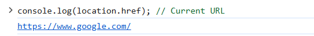

# JavaScript - Browser Object Model
The Browser Object Model (BOM) in JavaScript enables developers to interact with the browser beyond just the webpage content, offering control over essential features such as the browser window, URL (location), and browsing history.

## Browser Object Model in JavaScript
The Browser Object Model (BOM) in JavaScript helps to interact with the browser, not just the webpage. While the DOM handles the content of the page, BOM gives you control over things like the browser window, the URL, and the history. This means you can do things like resize the window, go back and forth in the browser history, or even find out what browser the user is using. In short, BOM helps JavaScript work with the browser to make web pages more interactive.

### Browser Object Model Types
Here are the main parts of the Browser Object Model (BOM)

| **Object**  | **Description**                                                                                      |
| ----------- | ---------------------------------------------------------------------------------------------------- |
| `window`    | Represents the browser window, controls aspects like size/location, and serves as the global object. |
| `navigator` | Provides details about the user's browser and operating system.                                      |
| `location`  | Manages the current URL; allows getting or changing the web address.                                 |
| `screen`    | Offers information about the user's screen, such as width and height.                                |
| `history`   | Gives access to the browser's session history, allowing navigation back/forward.                     |


### 1. Window Object
The window object is the main object in the BOM, representing the browser window or tab itself. It's the top-level object, and everything else in the browser is contained within it.

```bash
window.alert('Hello, World!');
console.log(window.innerWidth); 


```
* The window object provides methods like alert(), confirm(), and prompt().
* It also gives you access to other important objects, such as document, navigator, screen, location, and history.


### 2. Navigator Object
The navigator object provides information about the browser and the user's environment. It is often used to detect the browser type or features.

```bash
console.log(navigator.userAgent); 
console.log(navigator.language); 

```
navigator.userAgent can be used to identify the browser and its version, but it's not always reliable.
navigator.language tells you the user's preferred language.


### 3. Location Object
The location object allows you to interact with the URL of the current document. It can be used to retrieve or manipulate parts of the URL and navigate to different pages.

```bash
console.log(location.href); 
location.href = 'https://www.google.com'

```
location.href gives you the full URL.
You can change location.href to load a different page.




### Key Features of the BOM
1. Dynamic Browser Control: The BOM allows developers to control browser windows and perform operations like resizing, opening, and closing windows.
2. URL Manipulation: Through the location object, developers can retrieve, modify, and navigate URLs dynamically.
3. Browser and Device Information: The navigator object provides details about the user's browser, operating system, and hardware capabilities.
4. Screen and Resolution Access: Developers can access screen properties like width, height, and pixel depth for responsive design.
Session History Navigation: The history object enables smooth navigation through the user's browsing history.
5. Cookie Management: Using the document.cookie property, developers can set, retrieve, and delete cookies for session management.
6. Event Handling and Timers: Functions like setTimeout and setInterval allow scheduling and periodic execution of tasks.s the current web address (URL) and allows changes within the Browser Object Model (BOM).


# JavaScript HTML DOM
The JavaScript HTML DOM (Document Object Model) is a powerful tool that represents the structure of an HTML document as a tree of objects. It allows JavaScript to interact with the structure and content of a webpage. By manipulating the DOM, you can update the content, structure, and styling of a page without requiring a page reload.

### What is the JavaScript HTML DOM?
The JavaScript HTML DOM is an interface that allows programs to interact with web pages.

1. It provides a structured way to represent the document’s elements as objects.
2. Using JavaScript, developers can access, modify, or delete HTML elements on the webpage, enabling dynamic content updates.

### Features of JavaScript DOM
1. Tree Structure: The DOM is organized like a family tree, with elements that have parent-child relationships. It is easy to find and change things based on their positions.
2. Element Access: You can use different methods like getElementById, getElementsByTagName, and querySelector to access specific elements on a webpage


### What is HTML DOM?
1. HTML DOM stands for HTML Document Object Model.
2. It is a programming interface for web documents.
3. It represents the structure of an HTML document as a tree of objects.
4. With the HTML DOM, JavaScript can access and manipulate all elements of an HTML document.


## Accessing Elements in the DOM

### getElementById()
Retrieves an element by its id.

```bash
let heading = document.getElementById("title");
console.log(heading.textContent);
```

### getElementsByClassName()
Returns a collection of elements with a specified class.

```bash
let items = document.getElementsByClassName("list-item");
console.log(items[0].textContent);
```

### getElementsByTagName()
Selects elements by their tag name.

```bash
let paragraphs = document.getElementsByTagName("p");
console.log(paragraphs.length);
```

### querySelector()
Returns the first element matching a CSS selector.

```bash
let firstParagraph = document.querySelector("p");
console.log(firstParagraph.textContent);
```

### querySelectorAll()
Returns all elements matching a CSS selector.

```bash
let allParagraphs = document.querySelectorAll("p");
allParagraphs.forEach(p => console.log(p.textContent));
```

## Modifying the DOM
### Changing Content
You can modify the content of an element using textContent or innerHTML.

```bash
document.getElementById("title").textContent = "New Heading";
document.getElementById("content").innerHTML = "<b>Updated Content</b>";
```

### Changing Attributes
You can modify attributes like src, href, alt, etc.

```bash
document.getElementById("myImage").src = "new-image.jpg";
```

### Adding and Removing Elements
Create an element:

```bash
let newPara = document.createElement("p");
newPara.textContent = "This is a new paragraph.";
document.body.appendChild(newPara);
```

### Remove an element

```bash
let oldPara = document.getElementById("removeMe");
oldPara.remove();
```

## Event Handling in the DOM
JavaScript allows us to handle events such as clicks, keypresses, mouse movements, etc.


### Adding an Event Listener

```bash
document.getElementById("btn").addEventListener("click", function() { 
   alert("Button Clicked!");
});
```


### Removing an Event Listener

```bash
function sayHello() { 
   console.log("Hello!");
}
let btn = document.getElementById("btn");
btn.addEventListener("click", sayHello);
btn.removeEventListener("click", sayHello);
```

### Event Object
The event object provides details about the event.

```bash
document.getElementById("inputField").addEventListener("keyup", function(event) {
   console.log("Key pressed: ", event.key);
});
```


### Traversing the DOM
JavaScript provides properties to navigate through the DOM tree.

1. parentNode: Gets the parent element.
2. children: Gets all child elements.
3. firstChild / lastChild: Gets the first/last child.
4. nextSibling / previousSibling: Gets the next/previous sibling.

**Example:**
let parent = document.getElementById("myDiv").parentNode;
console.log(parent.tagName);